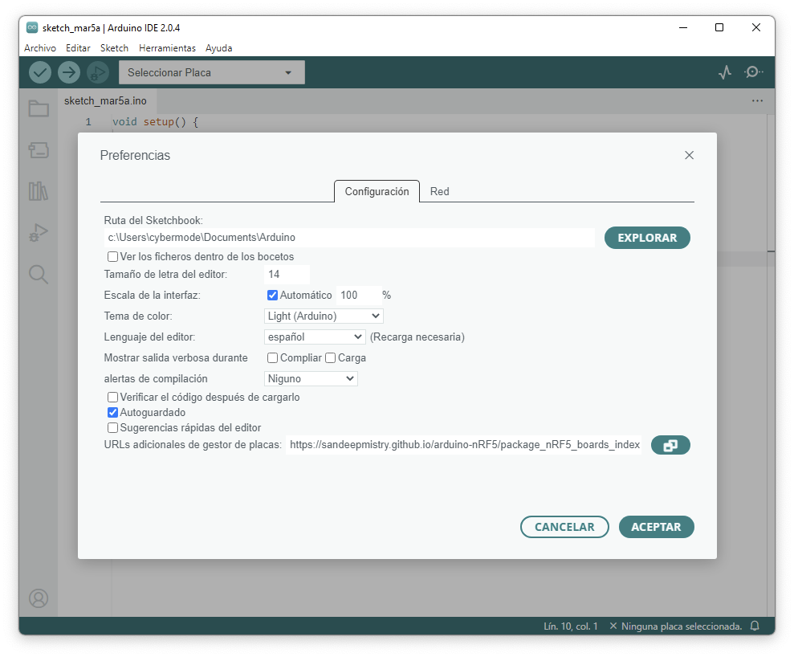

# Olimpiadas Teleco Microbit
Charla de Micro:Bit y Arduino IDE

http://olimpiadasteleco.com

Marzo 2023 - Escola de Enxeñaría de Telecomunicación - Universidade Vigo

1. Introducción a Micro:bit

2. Programación con Makecode

  https://makecode.microbit.org/

3. Programación con Arduino IDE

https://www.arduino.cc/en/software

- 3.1. Instalación librería placa nRF5

  Añadir la siguiente ruta en el gestor de placas de las Preferencias de Arduino IDE
  
  ```
    https://sandeepmistry.github.io/arduino-nRF5/package_nRF5_boards_index.json
  ```
  

  
  Una vez añadido, desde el gestor de placas buscar nRF5 o Micro:bit e instalar "Nordic Semiconductor nRF5 Boards"
  
  Ya podemos selecionar nuestra placa desde "Herramientas> Placa > Nordic Semiconductor nRF5 Boards > BBC Micro:bit V2"
  
  Una vez conectado por USB la Micro:bit al ordenador, podemos selecionarla desde "Herramientas > Puerto"
  
- 3.2. Primer código "Blink"

 ```c
const int COL1 = 4;  // Columna #1 control
const int LED = 21;  // 'Fila 1' led

void setup() {
   Serial.begin(9600);
  Serial.println("microbit activo!");

  // debido a que los LED están multiplexados, debemos conectar a tierra el lado opuesto del LED
  pinMode(COL1, OUTPUT);
  digitalWrite(COL1, LOW);
  pinMode(LED, OUTPUT);
}

void loop() {
  Serial.println("Enciende!");
  digitalWrite(LED, HIGH);
  delay(500);
  digitalWrite(LED, LOW);
  delay(500);
}
 ```
 
 - 3.3. Código "Botones"

 ```c
const int botonA = 5;       // Numero de pin del botón
const int botonB = 11;      // Numero de pin del botón
const int botonTouch = 26;  // Numero de pin del botón Táctil

void setup() {
  Serial.begin(9600);
  Serial.println("microbit activo!");
  pinMode(botonA, INPUT);
  pinMode(botonB, INPUT);
  pinMode(botonTouch, INPUT);
}

void loop() {}
if (!digitalRead(botonA)) {
  Serial.println("Botón A pulsado");
}
if (!digitalRead(botonB)) {
  Serial.printIn("Botón B pulsado");
}
if (!digitalRead(botonTouch)) {
  Serial.println("Botón Touch pulsado");
}
delay(10);
}
 ```
 - 3.4. Instalación librerías

  Adafruit GFX
  
  Adafruit Microbit
  
  BLEPeripheral
  
  LSM303AGR
  
   

 
  - 3.5. Código "Matriz LED"

 ```c
#include <Adafruit_Microbit.h>
Adafruit_Microbit_Matrix microbit;

const uint8_t
  smile_bmp[] =
  { B00000,
    B01010,
    B00000,
    B10001,
    B01110, };
    
void setup() {
  Serial.begin(9600);
  Serial.println("microbit matrix demo is ready!");
  microbit.begin();
}

void loop() {
  microbit.show(microbit.HEART);
  delay(1000);

  microbit.show(smile_bmp);
  delay(1000);

}
 ```
 
