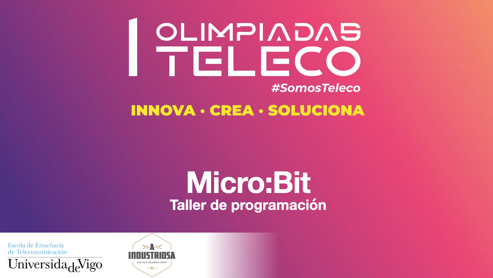
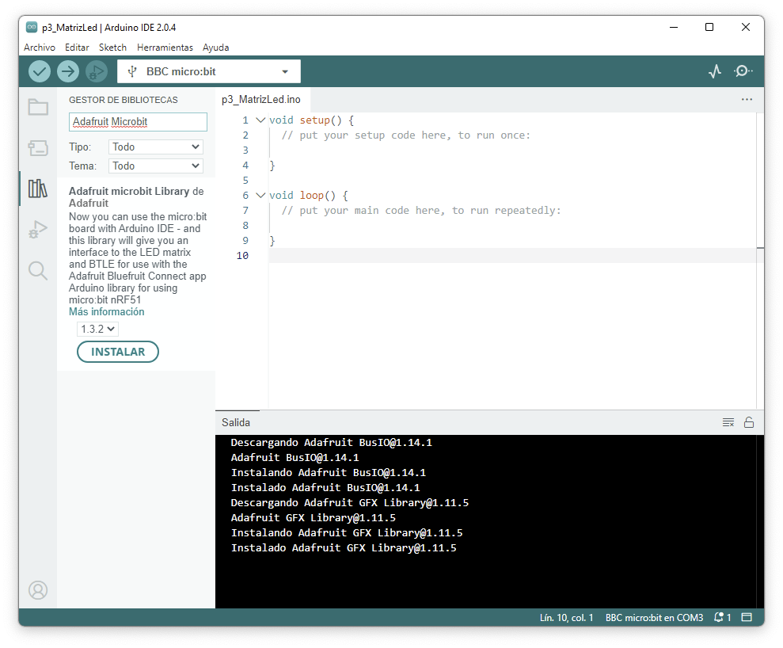

# Olimpiadas Teleco Microbit
Charla de Micro:Bit y Arduino IDE

http://olimpiadasteleco.com

Marzo 2023 - Escola de Enxeñaría de Telecomunicación - Universidade Vigo



1. Introducción a Micro:bit

2. Programación con Makecode

  https://makecode.microbit.org/

3. Programación con Arduino IDE

https://www.arduino.cc/en/software

- 3.1. Instalación librería placa nRF5

  Añadir la siguiente ruta en el gestor de placas de las Preferencias de Arduino IDE
  
  ```
    https://sandeepmistry.github.io/arduino-nRF5/package_nRF5_boards_index.json
  ```
  

  
  Una vez añadido, desde el gestor de placas buscar nRF5 o Micro:bit e instalar "Nordic Semiconductor nRF5 Boards"
  
  Ya podemos selecionar nuestra placa desde "Herramientas> Placa > Nordic Semiconductor nRF5 Boards > BBC Micro:bit V2"
  
  
  
  Una vez conectado por USB la Micro:bit al ordenador, podemos selecionarla desde "Herramientas > Puerto"
  
- 3.2. Primer código "Blink"

 ```c
const int COL1 = 4;  // Columna #1 control
const int LED = 21;  // 'Fila 1' led

void setup() {
   Serial.begin(9600);
  Serial.println("microbit activo!");

  // debido a que los LED están multiplexados, debemos conectar a tierra el lado opuesto del LED
  pinMode(COL1, OUTPUT);
  digitalWrite(COL1, LOW);
  pinMode(LED, OUTPUT);
}

void loop() {
  Serial.println("Enciende!");
  digitalWrite(LED, HIGH);
  delay(500);
  digitalWrite(LED, LOW);
  delay(500);
}
 ```
 
 - 3.3. Código "Botones"

 ```c
const int botonA = 5;       // Numero de pin del botón
const int botonB = 11;      // Numero de pin del botón
const int botonTouch = 26;  // Numero de pin del botón Táctil

void setup() {
  Serial.begin(9600);
  Serial.println("microbit activo!");
  pinMode(botonA, INPUT);
  pinMode(botonB, INPUT);
  pinMode(botonTouch, INPUT);
}

void loop() {}
if (!digitalRead(botonA)) {
  Serial.println("Botón A pulsado");
}
if (!digitalRead(botonB)) {
  Serial.printIn("Botón B pulsado");
}
if (!digitalRead(botonTouch)) {
  Serial.println("Botón Touch pulsado");
}
delay(10);
}
 ```
 - 3.4. Instalación librerías

Para manejar la matriz LED, el Bluetooh y otros sensores de la Micro:Bit necesitamos instalar otras librerías:

  Adafruit GFX
  
  Adafruit Microbit
  
  BLEPeripheral
  
  LSM303AGR
  
   
  
  
 
  - 3.5. Código "Matriz LED"

 ```c
#include <Adafruit_Microbit.h>
Adafruit_Microbit_Matrix microbit;

const uint8_t
  smile_bmp[] =
  { B00000,
    B01010,
    B00000,
    B10001,
    B01110, };
    
void setup() {
  Serial.begin(9600);
  Serial.println("microbit matrix demo is ready!");
  microbit.begin();
}

void loop() {
  microbit.show(microbit.HEART);
  delay(1000);

  microbit.show(smile_bmp);
  delay(1000);

}
 ```
   - 3.6. Pines Micro:bit v2

 ```
  // 0 - 4
  2,  // A0, LEFT PAD
  3,  // A1, MIDDLE PAD
  4,  // A2, RIGHT PAD
  31, // A3, COL3
  28, // A4, COL1

  // 5 - 9
  14, // BTN A
  37, // COL4, P1.05
  11, // COL2
  10, // NFC2
  9,  // NFC1

  // 10-16
  30, // A5, COL5
  23, // BTN B
  12,
  17, // SCK
  1,  // MISO
  13, // MOSI
  34, // P1.02

  // 17 + 18
  (uint32_t)-1, // 3.3V
  (uint32_t)-1, // 3.3V
  
   // 19 + 20
  26, // SCL
  32, // SDA, P1.00

  // 21 - 25
  21, // ROW1
  22, // ROW2
  15, // ROW3
  24, // ROW4
  19, // ROW5

  // 26 - 29
  36, // LOGO (touch sensor)
  0,  // SPEAKER (Note: Must use synthesized LF clock to make this pin available)
  20, // RUN_MIC
  5,  // A6, MIC_IN

  // 30 - 31
  16, // I2C_INT_SDA
  8,  // I2C_INT_SCL

  // 32 - 34
  25, // COMBINED_SENSOR_INT
  40, // RX, P1.08
  6,  // TX

 ```
  
